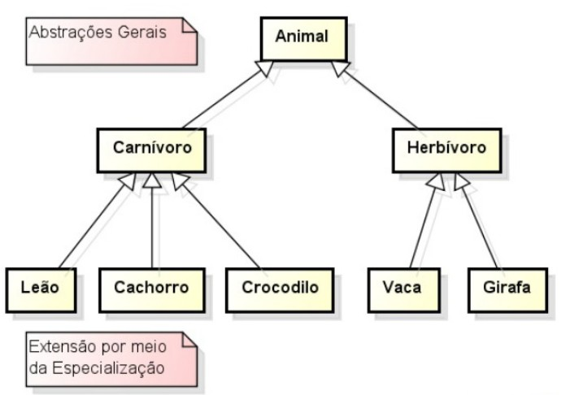

PROVA FINAL da disciplina de Introdução a programação orientada a objetos.

Graduação em Tecnologia em Sistemas para internet - UTFPR Toledo - PR.

DESCRIÇÃO: arquivo original [aqui](prova.pdf)
 
Introdução à Programação Orientada a Objetos (TSI32A)

Professor: Ivan Luiz Salvadori

Prova (individual e com consulta)

Atenção: Esta atividade será avaliada de acordo com o plano de ensino da disciplina.

1) De que forma a linguagem Java realiza o gerenciamento de memória referente aos objetos que não são mais utilizados por um determinado programa em execução? De que forma os objetos não utilizados são identificados pelo sistema de gerenciamento de memória do Java? Apresente argumentações sobre as questões anteriores.(peso 1,5)

Resposta: Os objetos não mais utilizados serão identificados pelo garbage collector que, por sua vez, irá liberar o espaço de memória que esse objeto ocupa para que outro dado possa ser alocado nesse mesmo espaço. Os objetos não utilizados são classificados dessa forma quando eles não possuem mais um apontador para o endereço de memória em que está armazenado; esse apontador é uma variável.

2) Descreva com suas palavras o conceito de herança na linguagem de programação Java. Qual a relação entre herança e visibilidade de atributos de uma classe? Argumente sobre sobrescrita e sobrecarga de métodos e a sua relação com herança. Argumente sobre classes abstratas e sua utilização. (peso 1,5)

Resposta: Herança em Java é o relacionameto hierárquico que uma classe tem com outra classe. Esse relacionamento possibilita confecionar classes mais abstratas e suas derivadas mais específicas, para representar sujeitos do mundo real, com mais facilidade evitando reescrever códigos. 
As classes podem ter 3 tipos de encapsulamentos para seus atributos: privado, que só pode ser visualizado dentro da própria classe; publico, permite a visualização por qualquer outra classe e protegido, que permite apenas a visualização pela propria classe e pelas suas classes filhas ou herdeiras.
A sobrescrita de métodos ocorre quando uma classe filha pega uma método da classe pai e modifica o seu comportamento, deve manter o mesmo tipo de retorno e os mesmos argumentos de entrada. Já a sobrecarga permite que sejam criados mais de um método com o mesmo nome mas com argumentos diferentes. Essas duas caracteristicas permitem que classes filhas possam tornar comportamentos herdados mais específicos.
As classes abstratas servem para definir comportamentos e propriedadas padrões comuns a mais de um tipo de classe, sendo assim não é possivel criar um objeto a partir de uma classe abstrata, apenas de uma de suas filhas.

3) De que forma são tratadas exceções em Java? Quais são os tipos de exceções disponíveis? Quais são as diferenças entre os tipos de exceções? Qual é o papel das exceções na implementação de sistemas orientados a objetos? (peso 1,5)

Resposta: As exceções em java são tratadas através de um bloco try-catch; que primeiro tenta executar um código(try) e caso uma exceção seja lançada ela é tratada de alguma forma(catch); ou throws; que lança a exceção para quem chamou o método. Os tipos de exceções são checadas e não checadas. As checadas devem ser tratadas e as não checadas podem ser tratadas mas não é obrigatório. O papel das exceções é parar a execução de um bloco de código ou de um método devido a uma execução que viola a alguma regra, e apresentar o motivo que gerou essa violação.

4) No contexto de programação orientada a objetos, descreva o significado de interface. Apresente argumentações sobre o uso de interface e o seu relacionamento com herança. (peso 1,5)

Resposta: A interface é a declaração de um ou mais métodos, cuja a classe que a utiliza é obrigada a implementar os metodos declarados. Ela pemite que uma classe possa implementar comportamentos herdados de mais de uma classe distinta.

5) Quais são os principais tipos de teste de software? Quais são as diferenças entre os tipos de teste? Quais são os objetivos para adotar testes de software? De que forma sistemas desenvolvidos em Java podem ser testados? Qual é a relação entre qualidade de modelagem de sistemas orientados a objetos com teste de software?(peso 1,5)

Resposta: Os principais tipos de teste de software são fim a fim, integração e unitários. Teste fim a fim testa todo o software, o teste de integração testa uma operação especifica dentro do software e o teste unitário se aplica somente a uma classe.
O objetivo de se adotar testes de software é verificar se cenários de uso do software apresentam o resultado esperado. Sistemas em Java podem ser testados com o auxilio de bibliotecas externas de testes, como o JUNIT; com as ferramentas dessas bibliotecas, são escritos códigos que executam funcionalidades do software e verificam se o resultado dessas ações é condizente com as regras de negócio estabelecidas. 
Um sistema com modelagem inapropriada dificulta ou impossibilita a implementação dos testes, isso ocorre quando as responsabilidades de uma classe ou método não são coerentes, abrangendo mais de uma função, por exemplo, um metodo que realiza a divisão de dois números inteiros, quando inserido algum valor inválido, deve retornar um exceção e não uma mensagem de texto na tela.

6) Implemente o diagrama de classes representado pela figura abaixo. As classes Animal, Carnivoro e Herbivoro devem ser abstratas. A implementação deve usar sobrescrita de métodos. O desenvolvedor é livre para (e deve) elaborar o conjunto de propriedades e métodos de cada classe do diagrama. O programador é livre para criar novas classes não representadas no diagrama caso julgar necessário. Não é necessário implementar o método Main, apenas a implementação das classes domodelo. O código-fonte das classes implementadas devem ser submetidas no link de entrega da prova disponibilizado no Moodle. (peso 2,5)
